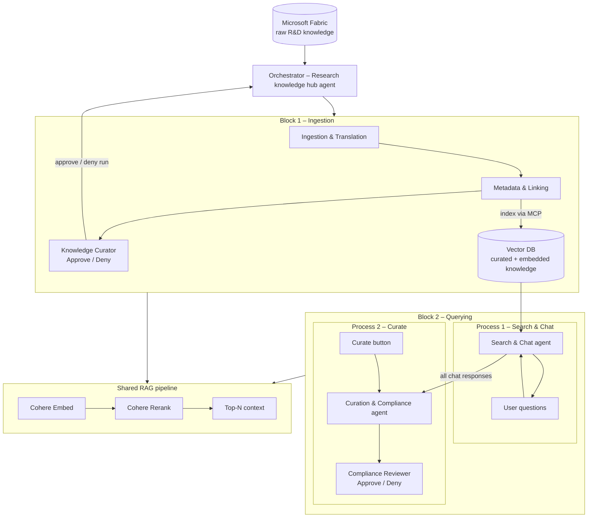

# Agentic R&D Knowledge Mining — Workflow Summary

Business and functional reference for the HLS Agentic R&D Knowledge Mining solution, built on **Microsoft Foundry**, **Agent Framework**, and **Cohere models**. The system is organized as **two independent blocks** — one for **ingesting** knowledge and one for **querying** it — bridged by a shared **Vector DB**.

---

## TL;DR

- The architecture is **not** a single continuous end-to-end pipeline. It is split into **two independent blocks**.
- **Block 1 — Ingestion:** reads **raw R&D knowledge from Microsoft Fabric**, then Ingestion & Translation -> Metadata & Linking (indexes to Vector DB) -> human approval gate.
- **Block 2 — Querying:** reads from **Vector DB** (Cohere Embed query -> Vector DB -> Cohere Rerank -> Top-N). It runs as **two processes**:
  - **Process 1 — Search & Chat:** the user asks questions and the agent responds (interactive loop, no gate).
  - **Process 2 — Curate:** a **"Curate" button** in the UI triggers the Curation & Compliance agent, which takes **all the Search & Chat responses** as input, produces flags and captured decisions, and presents the result to the user for **approve / deny**.
- The bridge between the two blocks is the **Vector DB**. Fabric is the **upstream source** of raw input for Block 1.

---

## Data flow at a glance

```
Microsoft Fabric (raw R&D knowledge)
        │  read
        ▼
BLOCK 1 — Ingestion
  Ingestion & Translation ─► Metadata & Linking ─► Vector DB write ─► [Approval gate: Knowledge Curator]
        ▼
   ┌──────────────────────────────┐
   │          Vector DB           │  ◄── bridge between blocks
   └──────────────────────────────┘
        │  read (Embed → Vector DB → Rerank → Top-N)
        ▼
BLOCK 2 — Querying
  Process 1: Search & Chat  (user Q&A loop, responses accumulate)
        │  user clicks "Curate"
        ▼
  Process 2: Curation & Compliance  (input = all Search & Chat responses)
        │
        ▼
   [Approval gate: Compliance Reviewer]  → approve / deny
```

Block 1 **writes** to the Vector DB. Block 2 **reads** from the Vector DB. Fabric sits **upstream** of Block 1 as the source of raw material; the Vector DB is the integration point between the two blocks.

---

## The two blocks

The blocks are decoupled. Block 1 populates the Vector DB; Block 2 consumes it. Block 2 does not wait on a Block 1 run — it operates against whatever knowledge already lives in the Vector DB, whenever a query or curation review is needed.

| | **Block 1 — Ingestion** | **Block 2 — Querying** |
|---|--------------------------|-------------------------|
| **Purpose** | Read raw R&D knowledge from Fabric, normalize and structure it, and persist it for retrieval | Let users query the knowledge (Search & Chat) and, on demand, curate/compliance-review the answers |
| **Input source** | **Microsoft Fabric** (raw R&D knowledge) | **Vector DB** (curated, embedded content from Block 1) |
| **Agents** | Ingestion & Translation -> Metadata & Linking | Search & Chat (process 1) -> Curation & Compliance (process 2) |
| **Human gate** | Knowledge Curator approves/denies the ingested + linked content (indexing already completed) | Compliance Reviewer approves/denies the curation result |
| **Output** | Curated, embedded knowledge **saved into Vector DB** | Grounded answers with citations/lineage; curation flags and captured decisions |
| **Trigger** | New raw material available in Fabric, scheduled run, or manual load | A researcher asks questions; then a user-initiated "Curate" action |

---

## Workflow diagram



The orchestrator coordinates both blocks but does **not** chain Block 1 into Block 2. Each block runs on its own trigger; the Vector DB is the durable bridge between them.

---

## Architecture layers

### 1. Orchestrator (Research knowledge hub agent)

- **Role:** coordinate the specialized agents within each block.
- **Function:** decide which agents run, in what order, and with what context **within a block**; propagate memory between steps; manage the human approval gate for that block.
- **Important:** the orchestrator treats Block 1 and Block 2 as **independent workflows**. It does not require a Block 1 run to precede a Block 2 run.
- **Implementation:** deployed as the primary agent on **Microsoft Foundry Agent Service**, orchestrating sub-agents via **Agent Framework**.

### 2. Specialized agents

Every agent shares the same technical stack:

| Component    | Technology                                |
|--------------|-------------------------------------------|
| Platform     | Microsoft Foundry Agent Service           |
| Orchestration| Agent Framework (Microsoft)               |
| Model        | Cohere Command A+                         |
| Memory       | Context across workflow steps             |
| Integration  | Azure MCP                                 |
| Retrieval    | Cohere Embed + Vector DB + Cohere Rerank  |

| Agent                        | Block | Business responsibility                                                              |
|------------------------------|-------|--------------------------------------------------------------------------------------|
| **Ingestion & Translation**  | 1     | Read raw knowledge from Fabric; de-duplicate and normalize formats                   |
| **Metadata & Linking**       | 1     | Extract entities and versions; link documents to datasets and studies (RAG); index content into Vector DB via MCP |
| **Search & Chat**            | 2     | Retrieve from the Vector DB with grounded citations and lineage; answer queries (RAG) |
| **Curation & Compliance**    | 2     | Receive the Search & Chat responses; flag gaps and sensitive content; capture decisions |

#### Concrete actions (per diagram)

| Agent | Actions |
|-------|---------|
| **Ingestion & Translation** | Read raw R&D knowledge from Fabric · De-duplicate, normalize formats |
| **Metadata & Linking** | Extract entities & versions · Link docs <-> datasets <-> studies · Index embeddable content into Vector DB |
| **Search & Chat** | Retrieve with grounded citations & lineage · Answer queries; draft summaries |
| **Curation & Compliance** | Flag gaps, sensitive content · Capture decisions over the collected chat responses |

### Microsoft Fabric — the raw-input source (Block 1)

- **Fabric is the source of raw R&D knowledge** that Block 1 reads. The R&D Knowledge sources (articles, protocols, ELN/LIMS records, datasets, results, submissions, partner repos, region policies) land in Fabric upstream of the workflow.
- The **Ingestion & Translation** agent reads raw content from Fabric, de-duplicates it, and normalizes formats before handing off to Metadata & Linking.


### Vector DB — the bridge between blocks

- After **Metadata & Linking** completes, the agent output (normalized content + extracted entities/versions + document<->dataset<->study links, embedded via **Cohere Embed**) is **saved into Vector DB** via the `index_rd_knowledge` MCP tool.
- The **Knowledge Curator** gate follows indexing and approves or denies the ingestion run; denial does not roll back indexed content (removal is a future iteration).
- **Block 2 reads from the Vector DB.** It is the system of record for retrieval and the integration point between the two blocks.
- Because the Vector DB is durable and independent, Block 2 can run at any time against the accumulated knowledge — no need to re-run ingestion to query.

### Shared RAG pipeline

```
Cohere Embed -> Vector DB -> Cohere Rerank -> Top-N context
```

| Stage | Function |
|-------|----------|
| **Cohere Embed** | In Block 1, embed curated content before writing to the Vector DB; in Block 2, embed the user query |
| **Vector DB** | Store and retrieve vectors (Azure AI Search or another compatible vector store) |
| **Cohere Rerank** | Re-order retrieved candidates by relevance before passing to the model |
| **Top-N context** | Final passages that ground generation with Cohere Command A+ |

In Block 1 the pipeline supports embedding/indexing on write; in Block 2 it powers grounded search and chat on read.

### 3. Governance and Responsible AI

- **App Insights** — operational performance of agents and endpoints
- **Tracing & monitoring** — traceability of reasoning, retrieval, and actions
- **Evaluations** — quality of extraction, retrieval, answers, and compliance decisions
- **Safety & compliance** — sensitive-content, PHI/PII, and HLS regulatory policies
- **Identity management** — access and security (Microsoft Entra ID)

---

## Block 2 in detail — two processes

Block 2 is not a single linear flow. It is two distinct, user-driven processes that share the same Vector DB context.

### Process 1 — Search & Chat (interactive)

- The user asks questions; the **Search & Chat** agent retrieves from the Vector DB (Embed -> Vector DB -> Rerank -> Top-N) and responds with **grounded citations and lineage**.
- This is an **interactive loop** with **no approval gate** — the user can ask as many questions as needed.
- The session's responses are **accumulated** so they can later feed curation.

### Process 2 — Curate (on demand)

- The user clicks a **"Curate" button** in the UI to start the curation process.
- The **Curation & Compliance** agent receives **all the Search & Chat responses from the session as its input**, then flags gaps and sensitive content and captures decisions.
- The curation result is **presented to the user for approve / deny** (Compliance Reviewer gate).

---

## Human-in-the-loop

| Gate | Block | Reviews | What it approves |
|------|-------|---------|------------------|
| **Block 1 gate** | 1 | Ingestion & Translation + Metadata & Linking output | Quality of ingested, normalized, and linked content **after it has been indexed to the Vector DB** |
| **Block 2 gate** | 2 | Curation & Compliance output (built from all Search & Chat responses) | Curation flags and captured decisions before they are finalized |

Search & Chat (Process 1) has no gate; the only Block 2 gate is on the curation result (Process 2). No sensitive content is finalized autonomously.

---

## Example use case

### Block 1 — Ingestion (runs when new raw material is available in Fabric)

1. **Orchestrator** starts Block 1 for the results of study **ABC-2024**.
2. **Ingestion & Translation** reads the raw study material **from Fabric**, de-duplicates documents, and normalizes formats (PDFs, tables, ELN records).
3. **Metadata & Linking** extracts entities (compound, phase, endpoint), versions, and links between the report, datasets, and related protocols, then **indexes embeddable content into the Vector DB**.
4. The **Knowledge Curator** reviews at the **Block 1 gate** and approves or denies the ingestion run.

### Block 2 — Querying (runs independently, any time)

**Process 1 — Search & Chat**

1. A researcher asks: *"Which protocols share the same primary endpoint as ABC-2024?"*
2. **Search & Chat** retrieves from the **Vector DB**, applies **Cohere Rerank**, and answers with citations and lineage. The researcher asks several follow-ups; responses accumulate.

**Process 2 — Curate**

3. The researcher clicks **"Curate"**. The **Curation & Compliance** agent receives **all the chat responses** and detects a section missing a reference to EU regional policy, flags it, and captures the decision.
4. The **Compliance Reviewer** reviews the curation result at the **Block 2 gate** -> **approve / deny**; the cycle is closed and audited.

Block 2 here runs against knowledge already in the Vector DB; it does not depend on a fresh Block 1 run.

---

## Implementation implications

| Dimension | Implication |
|-----------|-------------|
| **Domain** | HLS / R&D: scientific knowledge management, evidence traceability, regulatory compliance |
| **Architecture** | Two **independent** blocks (ingestion vs. querying), bridged by the **Vector DB** |
| **Sources** | **Microsoft Fabric** is the raw-input source for Block 1; the **Vector DB** is the read source for Block 2 |
| **Cohere models** | **Command A+** for reasoning/generation; **Embed** and **Rerank** for the RAG pipeline |
| **Platform** | **Microsoft Foundry Agent Service** hosting agents; **Agent Framework** for workflows and hand-offs |
| **Integrations** | Microsoft Fabric (raw source), Vector DB, Azure MCP |
| **AI** | LLM (Cohere Command A+) + RAG (Embed/Rerank) + memory + tools (MCP) |
| **Operations** | Traceability, evaluation, and compliance by design; App Insights and tracing required |
| **Human** | Two independent approval gates: Knowledge Curator (Block 1, after Vector DB indexing) and Compliance Reviewer (Block 2, on the curation result) |

### Implementation checklist

1. **Foundry:** provision the project; deploy Cohere Command A+, Embed, and Rerank; configure Agent Service.
2. **Agent Framework:** define the orchestrator and two **independent** workflows (Block 1 and Block 2) plus the four sub-agents.
3. **Fabric (source):** connect Block 1's Ingestion & Translation agent to read raw R&D knowledge from Fabric.
4. **Vector DB (bridge):** create the vector index (Azure AI Search or other); metadata-linking agent embeds and writes curated content via MCP; Block 2 reads from it (Embed -> Vector DB -> Rerank -> Top-N).
5. **Block 2 processes:** implement Process 1 (interactive Search & Chat loop) and Process 2 (UI "Curate" button -> Curation & Compliance over accumulated chat responses).
6. **MCP:** expose tools for Fabric reads, Vector DB read/write, and curation/compliance actions.
7. **HITL:** implement two independent approve/deny gates — Knowledge Curator closing Block 1 (after Vector DB indexing) and Compliance Reviewer closing Block 2 (on the curation result).
8. **Governance:** enable App Insights, tracing, evaluations, and Entra ID from the first deployment.