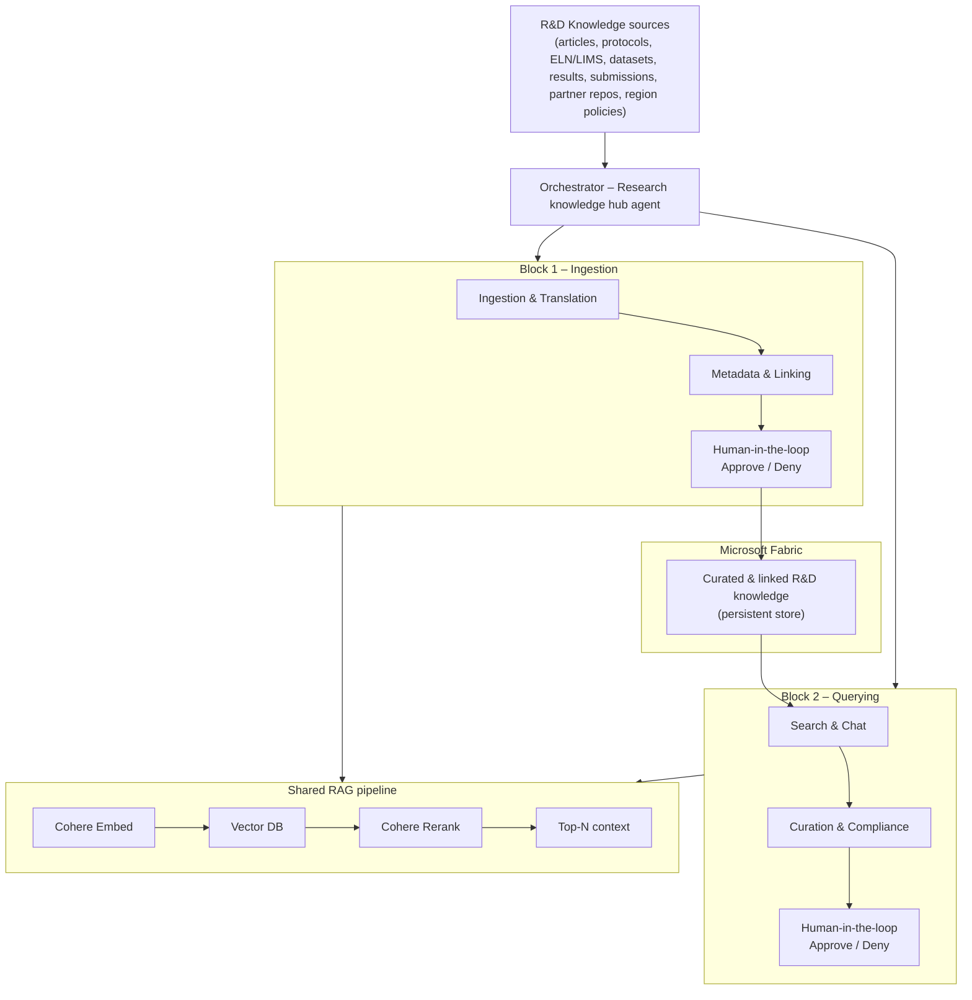

# Agentic R&D Knowledge Mining — Workflow Summary

Business and functional reference for the HLS Agentic R&D Knowledge Mining solution, built on **Microsoft Foundry**, **Agent Framework**, and **Cohere models**. The system is organized as **two independent blocks** — one for **ingesting** knowledge and one for **querying** it — that share a common knowledge store but run as separate workflows.

---

## TL;DR

- The architecture is **not** a single continuous end-to-end pipeline.
- It is split into **two independent blocks**:
  - **Block 1 — Ingestion** (Ingestion & Translation → Metadata & Linking → human approval gate)
  - **Block 2 — Querying** (Search & Chat → Curation & Compliance → human approval gate)
- Block 1 is **not a prerequisite trigger** for Block 2. They are decoupled and run on their own schedules/triggers.
- The only thing connecting them is the **shared knowledge store**: everything Block 1 produces lives in **Microsoft Fabric**, and Block 2 reads from it.
- Each block ends with its own **human-in-the-loop** approval gate (Approved / Denied).

---

## The two blocks

The two blocks are decoupled. Block 1 populates the knowledge store; Block 2 consumes it. Block 2 does not wait on a Block 1 run — it operates against whatever knowledge already lives in Fabric, whenever a query or compliance review is needed.

| | **Block 1 — Ingestion** | **Block 2 — Querying** |
|---|--------------------------|-------------------------|
| **Purpose** | Bring in raw R&D knowledge, normalize it, structure it, and persist it | Let users query the knowledge and run curation/compliance over it |
| **Agents** | Ingestion & Translation → Metadata & Linking | Search & Chat → Curation & Compliance |
| **Human gate** | Approve / Deny the ingested + structured content | Approve / Deny query results and curation findings |
| **Trigger** | New source material arrives, scheduled ingestion run, manual load | A researcher asks a question, a compliance review is scheduled, an audit runs |
| **Output** | Curated, linked knowledge persisted in **Fabric** | Grounded answers with citations/lineage; flagged gaps and compliance decisions |

### How they relate

```
BLOCK 1 (Ingestion)                          BLOCK 2 (Querying)
Ingestion & Translation                      Search & Chat
        │                                            │
        ▼                                            ▼
Metadata & Linking                           Curation & Compliance
        │                                            │
        ▼                                            ▼
[Approval gate]                              [Approval gate]
        │                                            ▲
        ▼                                            │
   ┌─────────────────────────────────────────────────┐
   │         Microsoft Fabric (knowledge store)      │
   └─────────────────────────────────────────────────┘
```

Block 1 **writes** to Fabric. Block 2 **reads** from Fabric. There is no direct hand-off between the two blocks — Fabric is the integration point.

---

## Workflow diagram



The orchestrator coordinates both blocks but does **not** chain Block 1 into Block 2. Each block is invoked on its own trigger; Fabric is the durable bridge between them.

---

## Architecture layers

### 1. Orchestrator (Research knowledge hub agent)

- **Role:** coordinate the specialized agents within each block.
- **Function:** decide which agents run, in what order, and with what context **within a block**; propagate memory between the two agents of a block; manage the human approval gate for that block.
- **Important:** the orchestrator treats Block 1 and Block 2 as **independent workflows**. It does not require a Block 1 run to precede a Block 2 run.
- **Implementation:** deployed as the primary agent on **Microsoft Foundry Agent Service**, orchestrating sub-agents via **Agent Framework**.

### 2. Specialized agents

Every agent shares the same technical stack:

| Component    | Technology                                |
|--------------|-------------------------------------------|
| Platform     | Microsoft Foundry Agent Service           |
| Orchestration| Agent Framework (Microsoft)               |
| Model        | Cohere Command A+                         |
| Memory       | Context across workflow steps             |
| Integration  | Azure MCP                                 |
| Retrieval    | Cohere Embed + Vector DB + Cohere Rerank  |

| Agent                        | Block | Business responsibility                                                               |
|------------------------------|-------|---------------------------------------------------------------------------------------|
| **Ingestion & Translation**  | 1     | Connect to portals/sources; de-duplicate and normalize formats                        |
| **Metadata & Linking**       | 1     | Extract entities and versions; link documents to datasets and studies (RAG)           |
| **Search & Chat**            | 2     | Retrieve with grounded citations and lineage; answer queries and draft summaries (RAG)|
| **Curation & Compliance**    | 2     | Flag gaps and sensitive content; prompt owners and capture decisions                  |

#### Concrete actions (per diagram)

| Agent | Actions |
|-------|---------|
| **Ingestion & Translation** | Connect portals · De-duplicate, normalize formats |
| **Metadata & Linking** | Extract entities & versions · Link docs ↔ datasets ↔ studies |
| **Search & Chat** | Retrieve with grounded citations & lineage · Answer queries; draft summaries |
| **Curation & Compliance** | Flag gaps, sensitive content · Prompt owners, capture decisions |

### Microsoft Fabric — the knowledge store

All knowledge produced by **Block 1** is persisted in **Microsoft Fabric**:

- After the Block 1 approval gate, the curated, normalized, and linked content (entities, versions, document↔dataset↔study relationships) lands in Fabric.
- Fabric is the **system of record** for the mined R&D knowledge and the **source** that Block 2 queries.
- Because the store is durable and independent, Block 2 can run at any time against the accumulated knowledge — there is no need to re-run ingestion to query.

### Shared RAG pipeline

Both blocks rely on a common retrieval pipeline:

```
Cohere Embed → Vector DB → Cohere Rerank → Top-N context
```

| Stage | Function |
|-------|----------|
| **Cohere Embed** | Generate vector embeddings of indexed content |
| **Vector DB** | Store and retrieve vectors (Azure AI Search or another compatible vector store) |
| **Cohere Rerank** | Re-order candidates by relevance before passing to the model |
| **Top-N context** | Final passages that ground generation with Cohere Command A+ |

In Block 1 the pipeline supports linking (embedding content for indexing); in Block 2 it powers grounded search and chat.

### 3. Data / systems of record

| System | Use |
|--------|-----|
| **Microsoft Fabric** | Durable store for mined, curated R&D knowledge; the bridge between Block 1 and Block 2 |
| **R&D Content management system** | Central research-content repository; destination for metadata and links |
| **Research articles** | Scientific articles and reference publications |
| **Brand guidelines** | Brand and scientific-communication guidance |
| **Preference / compliance data** | Policies, regional preferences, and compliance rules |
| **Partner / vendor repos** | External partner and vendor repositories |
| **Inventory** | Inventory of knowledge assets (datasets, protocols, submissions) |
| **Data Entry portal** | Manual entry, corrections, and overrides |

Agents read/write these systems through **Azure MCP**.

#### Input sources (R&D Knowledge)

- Research articles and protocols
- ELN/LIMS-style records (Electronic Lab Notebook / Laboratory Information Management System)
- Datasets, results, and submissions
- Partner/vendor repositories
- Regional policies

### 4. Governance and Responsible AI

- **App Insights** — operational performance of agents and endpoints
- **Tracing & monitoring** — traceability of reasoning, retrieval, and actions
- **Evaluations** — quality of extraction, retrieval, answers, and compliance decisions
- **Safety & compliance** — sensitive-content, PHI/PII, and HLS regulatory policies
- **Identity management** — access and security (Microsoft Entra ID)

---

## Human-in-the-loop

Each block has its own independent approval gate:

| Gate | Block | Reviews output of | What it approves |
|------|-------|-------------------|------------------|
| **Block 1 gate** | 1 | Ingestion & Translation + Metadata & Linking | Quality of ingested, normalized, and linked content before it persists to Fabric |
| **Block 2 gate** | 2 | Search & Chat + Curation & Compliance | Generated answers and curation/compliance findings before they are finalized |

No sensitive content is published or finalized autonomously; a human signs off at the end of each block.

---


---

## Example use case

### Block 1 — Ingestion (runs when new material arrives)

1. **Orchestrator** starts Block 1 for the results of study **ABC-2024**.
2. **Ingestion & Translation** connects to the study portal, de-duplicates documents, and normalizes formats (PDFs, tables, ELN records).
3. **Metadata & Linking** extracts entities (compound, phase, endpoint), versions, and links between the report, datasets, and related protocols; indexes content in the Vector DB via Cohere Embed.
4. A reviewer approves the ingested package at the **Block 1 gate** → the curated, linked knowledge is **persisted to Microsoft Fabric**.

### Block 2 — Querying (runs independently, any time)

1. **Orchestrator** starts Block 2 when a researcher asks: *"Which protocols share the same primary endpoint as ABC-2024?"*
2. **Search & Chat** reads from **Fabric**, retrieves relevant context, applies Cohere Rerank, and answers with citations and lineage.
3. **Curation & Compliance** detects a section missing a reference to EU regional policy and prompts the study owner.
4. A reviewer approves the results at the **Block 2 gate** → the query/curation cycle is closed and audited.

Block 2 here runs against knowledge already in Fabric; it does not depend on a fresh Block 1 run.

---

## Implementation implications

| Dimension | Implication |
|-----------|-------------|
| **Domain** | HLS / R&D: scientific knowledge management, evidence traceability, regulatory compliance |
| **Architecture** | Two **independent** blocks (ingestion vs. querying), bridged by Microsoft Fabric |
| **Cohere models** | **Command A+** for reasoning/generation; **Embed** and **Rerank** for the RAG pipeline |
| **Platform** | **Microsoft Foundry Agent Service** hosting agents; **Agent Framework** for workflows and hand-offs |
| **Persistence** | **Microsoft Fabric** as the durable knowledge store and integration point between blocks |
| **Integrations** | R&D CMS, partner repos, data portals, Vector DB, Azure MCP |
| **AI** | LLM (Cohere Command A+) + RAG (Embed/Rerank) + memory + tools (MCP) |
| **Operations** | Traceability, evaluation, and compliance by design; App Insights and tracing required |
| **Human** | Two independent approval gates, one per block; no autonomous publishing of sensitive content |

### Implementation checklist

1. **Foundry:** provision the project; deploy Cohere Command A+, Embed, and Rerank; configure Agent Service.
2. **Agent Framework:** define the orchestrator and two **independent** workflows (Block 1 and Block 2) plus the four sub-agents.
3. **Fabric:** stand up the Fabric knowledge store; have Block 1 write curated/linked knowledge to it and Block 2 read from it.
4. **RAG:** create the vector index (Azure AI Search or other); pipeline Embed → store → Rerank → Top-N.
5. **MCP:** expose tools for the CMS, portals, compliance data, and inventory.
6. **HITL:** implement two independent approve/deny gates — one closing Block 1 (before persistence to Fabric) and one closing Block 2.
7. **Governance:** enable App Insights, tracing, evaluations, and Entra ID from the first deployment.
