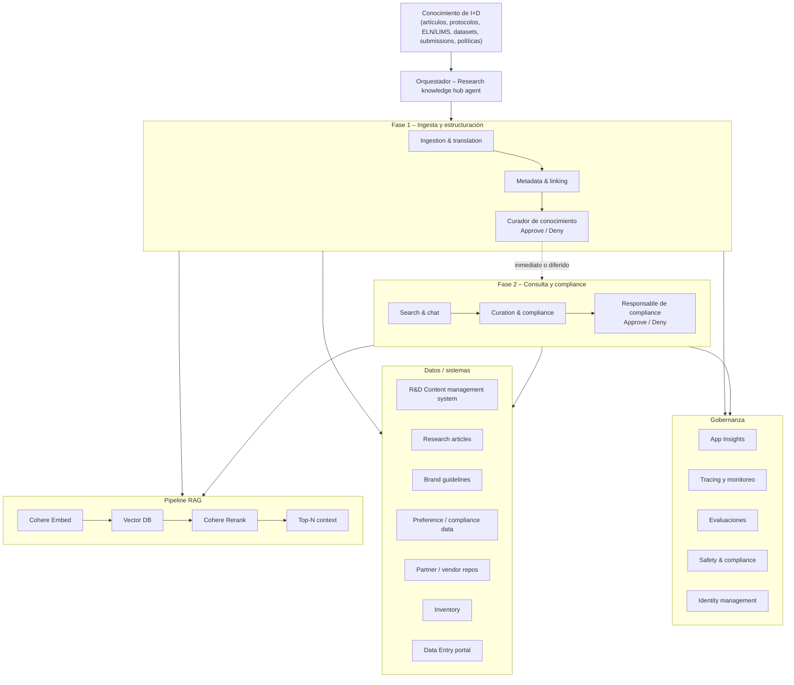

# Agentic R&D Knowledge Mining — Workflow Summary

Referencia de negocio y funcionalidad basada en el diagrama de arquitectura del proyecto. Orientada a equipos que implementan la solución con **Microsoft Foundry**, **Agent Framework** y **modelos Cohere**, sin requerir conocimiento previo del dominio de I+D farmacéutico.

## Problema de negocio

Sistema de **minería de conocimiento de I+D** para organizaciones de Healthcare & Life Sciences (HLS). Centraliza artefactos de investigación dispersos — artículos, protocolos, registros de laboratorio, datasets, resultados y políticas regionales — y los convierte en un **hub de conocimiento consultable**, trazable y gobernado.

Desafíos que aborda:

- Ingerir y normalizar fuentes heterogéneas (portales, ELN/LIMS, repositorios de partners, submissions)
- Extraer metadatos, entidades y versiones; vincular documentos con estudios y datasets
- Permitir búsqueda y chat con **citas fundamentadas** y linaje de la evidencia
- Detectar brechas de contenido y material sensible; cumplir políticas de compliance
- Mantener **supervisión humana** en dos fases independientes, cada una con su propio actor (curación de conocimiento y compliance)

## Dos fases del workflow

El sistema no es un pipeline único de punta a punta: se organiza en **dos fases secuenciales**, separadas por una aprobación humana. Cada fase agrupa dos agentes y un actor humano que revisa la salida conjunta de ambos.

| | **Fase 1 — Ingesta y estructuración** | **Fase 2 — Consulta y compliance** |
|---|--------------------------------------|--------------------------------------|
| **Agentes** | Ingestion & translation → Metadata & linking | Search & chat → Curation & compliance |
| **Actor humano** | Curador de conocimiento | Responsable de compliance |
| **Qué aprueba** | Calidad de ingestión, metadatos y enlaces | Respuestas de búsqueda/chat y hallazgos de curación |
| **Resultado** | Contenido publicado en el hub | Ciclo de compliance cerrado y auditado |

### Encadenamiento entre fases

La fase 2 **solo puede iniciarse tras el approve de la fase 1**, pero no tiene por qué ser de forma inmediata:

| Modo | Cuándo ocurre | Ejemplo |
|------|---------------|---------|
| **Inmediato** | La fase 2 arranca en cuanto el curador aprueba | Ciclo completo de incorporación de un estudio en una sola sesión |
| **Diferido** | La fase 2 se ejecuta en otro momento, días o semanas después | Tras la publicación, un investigador consulta el hub o se programa una auditoría de compliance |

En ambos modos el orquestador **persiste el contexto de la fase 1** y lo reutiliza al reanudar la fase 2, sin re-ejecutar ingestión ni vinculación.

```
Fase 1 ──[approve curador]──► Fase 2
              │
              ├── inmediato  (misma sesión)
              └── diferido   (otro momento: consulta, auditoría, notificación a owner)
```

## Flujo general

El workflow es **secuencial en dos fases** (ver sección anterior). El diagrama siguiente muestra ambas fases, sus agentes y el enlace punteado que indica que la fase 2 puede encadenarse de inmediato o en otro momento.



## Capas de la arquitectura

### 1. Orquestador (Research knowledge hub agent)

- **Rol:** coordinar el flujo entre agentes especializados del hub de conocimiento.
- **Entrada:** artefactos y solicitudes de conocimiento de I+D (nuevos documentos, consultas de investigadores, revisiones de compliance).
- **Función:** definir qué agentes corren, en qué orden y con qué contexto; propagar memoria entre pasos; **pausar entre fases** hasta recibir aprobación humana y **reanudar la fase 2** cuando corresponda (inmediato o diferido).

**Implementación:** desplegar como agente principal en **Microsoft Foundry Agent Service**, orquestando sub-agentes vía **Agent Framework**.

### 2. Agentes especializados

Cada agente comparte la misma pila técnica:

| Componente   | Tecnología                          |
|--------------|-------------------------------------|
| Plataforma   | Microsoft Foundry Agent Service     |
| Orquestación | Agent Framework (Microsoft)         |
| Modelo       | Cohere Command A+                   |
| Memoria      | Contexto entre pasos del workflow   |
| Integración  | Azure MCP                           |
| Retrieval    | Cohere Embed + Vector DB + Cohere Rerank |

| Agente                         | Fase | Responsabilidad de negocio                                                                 |
|--------------------------------|------|--------------------------------------------------------------------------------------------|
| **Ingestion & translation**    | 1    | Conecta a portales y fuentes; desduplica y normaliza formatos de datos                   |
| **Metadata & linking**         | 1    | Extrae entidades y versiones; vincula documentos con datasets y estudios (RAG)           |
| **Search & chat**              | 2    | Retrieval con citas fundamentadas y linaje; responde consultas y redacta resúmenes (RAG)  |
| **Curation & compliance**      | 2    | Marca brechas y contenido sensible; notifica a responsables y registra decisiones        |

#### Acciones por agente (según diagrama)

| Agente | Acciones concretas |
|--------|-------------------|
| **Ingestion & translation** | Conectar a portales · Desduplicar y normalizar formatos |
| **Metadata & linking** | Extraer entidades y versiones · Vincular documentos con datasets y estudios |
| **Search & chat** | Retrieval con citas fundamentadas y linaje · Responder consultas y redactar resúmenes |
| **Curation & compliance** | Marcar brechas y contenido sensible · Notificar a responsables y capturar decisiones |

### Pipeline RAG compartido

Los agentes de **Metadata & linking** y **Search & chat** utilizan un pipeline de retrieval común:

```
Cohere Embed → Vector DB → Cohere Rerank → Top-N context
```

| Etapa | Función |
|-------|---------|
| **Cohere Embed** | Genera embeddings vectoriales del contenido indexado |
| **Vector DB** | Almacena y recupera vectores (Azure AI Search u otro vector store compatible) |
| **Cohere Rerank** | Reordena candidatos por relevancia antes de pasarlos al modelo |
| **Top-N context** | Fragmentos finales que alimentan la generación con Cohere Command A+ |

### Orden de ejecución

Los cuatro agentes se ejecutan **en secuencia dentro de cada fase**. El orquestador coordina una fase a la vez, propaga memoria entre los dos agentes de esa fase y **pausa entre fases** hasta recibir la aprobación humana correspondiente.

La fase 2 arranca tras el approve de la fase 1, ya sea **de inmediato** (ciclo continuo en la misma sesión) o **en otro momento** (consulta de un investigador, auditoría programada, respuesta de un owner a una notificación de curación). En el modo diferido, el orquestador retoma el contexto persistido sin re-ejecutar ingestión ni vinculación.

**Cadena de ejecución:**

```
Fase 1:  Ingestion & translation → Metadata & linking → [Curador de conocimiento]
              │
              ├── inmediato ──► Fase 2
              └── diferido  ──► Fase 2 (en otro momento)
Fase 2:  Search & chat → Curation & compliance → [Responsable de compliance]
```

#### Fase 1 — Ingesta y estructuración

| Paso | Qué hace | Actor |
|------|----------|-------|
| **Ingestion & translation** | Conecta a portales y fuentes externas; desduplica y normaliza formatos heterogéneos | Agente |
| **Metadata & linking** | Extrae entidades, versiones y relaciones; vincula documentos con datasets y estudios (RAG) | Agente |
| **Human-in-the-loop** | Revisa la **salida conjunta** de ingestión y vinculación: calidad de datos, metadatos, enlaces y coherencia del grafo | **Curador de conocimiento** (actor 1) |

El curador valida que el contenido ingerido y su estructura son correctos antes de que el conocimiento quede disponible para consulta o curación posterior.

#### Fase 2 — Consulta y compliance

| Paso | Qué hace | Actor |
|------|----------|-------|
| **Search & chat** | Expone el conocimiento aprobado; responde consultas con citas fundamentadas y linaje (RAG) | Agente |
| **Curation & compliance** | Detecta brechas, contenido sensible o desactualizado; notifica a owners y registra decisiones | Agente |
| **Human-in-the-loop** | Revisa la **salida conjunta** de búsqueda/chat y curación: respuestas, hallazgos de compliance y acciones propuestas | **Responsable de compliance** (actor 2) |

La fase 2 es un **ciclo de revisión** que el orquestador dispara al instante o más tarde. Puede incluir consultas de búsqueda/chat y la pasada de curación de compliance en la misma ejecución.

#### Resumen de actores humanos

| Actor | Fase | Revisa salida de | Cuándo |
|-------|------|------------------|--------|
| **Curador de conocimiento** | 1 | Ingestion & translation + Metadata & linking | Al cierre de la fase 1 |
| **Responsable de compliance** | 2 | Search & chat + Curation & compliance | Al cierre de la fase 2 (inmediato o diferido respecto a la fase 1) |

En términos de gestión del conocimiento: **ingesta → estructuración → aprobación (curador) → [pausa opcional] → consulta → curación → aprobación (compliance)**.

**Secuencia lógica del workflow:**

1. **Fase 1:** ingerir y normalizar artefactos; extraer metadatos y enlaces.
2. **Fase 1 — HITL:** el curador de conocimiento aprueba o rechaza el paquete de ingestión + metadatos.
3. **Transición:** la fase 2 puede iniciarse de inmediato o quedar pendiente para otro momento.
4. **Fase 2:** ejecutar búsqueda/chat y curación de compliance sobre el contenido ya aprobado.
5. **Fase 2 — HITL:** el responsable de compliance aprueba o rechaza el resultado de consulta + curación.

### 3. Datos / sistemas de registro

| Sistema | Uso |
|---------|-----|
| **R&D Content management system** | Repositorio central de contenido de investigación; destino de metadatos y enlaces |
| **Research articles** | Artículos científicos y publicaciones de referencia |
| **Brand guidelines** | Directrices de marca y comunicación científica |
| **Preference / compliance data** | Políticas, preferencias regionales y reglas de compliance |
| **Partner / vendor repos** | Repositorios externos de partners y proveedores |
| **Inventory** | Inventario de activos de conocimiento (datasets, protocolos, submissions) |
| **Data Entry portal** | Entrada manual, correcciones y overrides |

Los agentes leen y escriben vía **Azure MCP** contra estos sistemas.

#### Fuentes de entrada (R&D Knowledge)

El diagrama identifica como punto de partida del workflow:

- Artículos y protocolos de investigación
- Registros estilo ELN/LIMS (Electronic Lab Notebook / Laboratory Information Management System)
- Datasets, resultados y submissions
- Repositorios de partners/vendors
- Políticas regionales

### 4. Gobernanza y Responsible AI

- **App Insights** — rendimiento operativo de agentes y endpoints
- **Tracing & monitoring** — trazabilidad de razonamiento, retrieval y acciones
- **Evaluations** — calidad de extracción, retrieval, respuestas y decisiones de compliance
- **Safety & compliance** — políticas de contenido sensible, PHI/PII y normativa HLS
- **Identity management** — acceso y seguridad (Microsoft Entra ID)

## Leyenda del diagrama

| Símbolo | Significado |
|---------|-------------|
| Caja morada | Agente |
| Caja verde | Modelo (Cohere Command A+) |
| Caja beige | Sistemas / datos externos |
| Caja azul | Acciones del agente |
| Persona (rosa) | Human-in-the-loop: dos actores distintos (curador de conocimiento · responsable de compliance) |
| Lupa (RAG) | Retrieval-Augmented Generation: metadatos, búsqueda y citas fundamentadas |

## Caso de uso de ejemplo

**Entrada:** "Incorporar al hub los resultados del estudio ABC-2024 y permitir consultas sobre su relación con protocolos previos".

### Fase 1 — Ingesta y estructuración

1. **Orquestador** inicia la fase 1.
2. **Ingestion & translation** conecta al portal del estudio, desduplica documentos y normaliza formatos (PDF, tablas, registros ELN).
3. **Metadata & linking** extrae entidades (compuesto, fase, endpoint), versiones y enlaces entre el informe, datasets y protocolos relacionados; indexa en Vector DB vía Cohere Embed.
4. El **curador de conocimiento** (actor 1) revisa en conjunto la calidad de la ingestión y el grafo de metadatos/enlaces → **Approve**. El contenido queda publicado en el hub.

### Fase 2 — Consulta y compliance *(inmediata o diferida)*

*Escenario A — inmediato:* la fase 2 arranca en cuanto el curador aprueba.

*Escenario B — diferido:* dos semanas después, un investigador consulta el hub; el orquestador retoma el contexto de la fase 1 y dispara la fase 2.

5. **Search & chat** responde a *"¿Qué protocolos comparten el mismo endpoint primario?"* con citas y linaje; usa Cohere Rerank para priorizar contexto relevante.
6. **Curation & compliance** detecta una sección sin referencia a política regional EU y notifica al owner del estudio.
7. El **responsable de compliance** (actor 2) revisa en conjunto las respuestas generadas y las acciones de curación propuestas → **Approve**; el ciclo queda cerrado y auditado.

## Implicaciones para la implementación

| Dimensión | Implicación |
|-----------|-------------|
| **Dominio** | HLS / R&D: gestión del conocimiento científico, trazabilidad de evidencia, compliance regulatorio |
| **Arquitectura** | Dos fases secuenciales con orquestación pausable (Agent Framework + Foundry); fase 2 inmediata o diferida |
| **Modelos Cohere** | **Command A+** para razonamiento y generación; **Embed** y **Rerank** para el pipeline RAG |
| **Plataforma** | **Microsoft Foundry Agent Service** como host de agentes; **Agent Framework** para definir workflows y handoffs |
| **Integraciones** | CMS de I+D, repositorios de partners, portales de datos, Vector DB, Azure MCP |
| **IA** | LLM (Cohere Command A+) + RAG (Embed/Rerank) + memoria + herramientas (MCP) |
| **Operación** | Trazabilidad, evaluación y compliance desde el diseño; App Insights y tracing obligatorios |
| **Humano** | Dos fases con dos actores distintos: curador (fase 1) y compliance (fase 2); la fase 2 puede ser inmediata o diferida; no publicación autónoma de contenido sensible |

### Checklist para equipos de implementación

1. **Foundry:** provisionar proyecto, desplegar Cohere Command A+, Embed y Rerank; configurar Agent Service.
2. **Agent Framework:** definir el orquestador, dos sub-workflows (fase 1 y fase 2) y los cuatro sub-agentes; soportar pausa entre fases y reanudación diferida con contexto persistido.
3. **RAG:** crear índice vectorial (Azure AI Search u otro); pipeline Embed → store → Rerank → Top-N.
4. **MCP:** exponer herramientas para CMS, portales, compliance data e inventory.
5. **HITL:** implementar dos flujos de approve/deny con actores distintos — curador tras fase 1 (ingesta + metadatos) y compliance tras fase 2 (búsqueda + curación); soportar reanudación diferida de la fase 2 con contexto persistido.
6. **Gobernanza:** habilitar App Insights, tracing, evaluaciones y Entra ID desde el primer despliegue.
